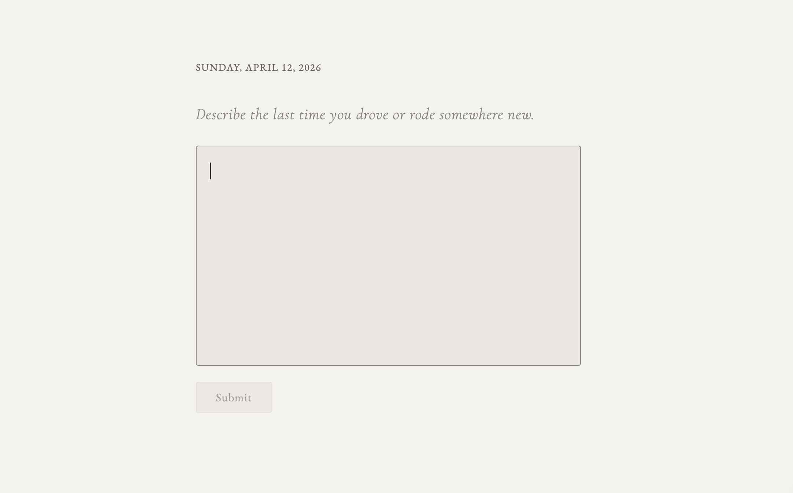

# Alice

A personal, monastic daily thinking journal. One question per day. No gamification. No dashboard. Just depth.

## What It Does

Alice asks you one question every day. You answer it. That's it.

There is no feed, no streak counter, no summary of your progress. Your responses go into a black box. You never see them again. The system sees them. You don't.

The instrument validates its own measurements. A reconstruction pipeline generates a synthetic writing session from the person's behavioral profile (vocabulary via Markov chain, timing from motor fingerprint, revision from deletion profile) and runs it through the same signal pipeline. The structured gap between reconstruction and reality -- the reconstruction residual -- characterizes what the instrument captures and what it does not. Motor execution produces the largest residual: the reconstruction types from the right distributions but not in the right sequences. The motor channel measures cognitive-motor coupling, not just motor output. This is where the mind shows in the measurements.

## Why This Architecture

The system measures, the system retrieves, the system juxtaposes. The system does not narrate.

**Text-only narrative interpretation is commoditizable.** Anything a frontier model can say after reading the same chat transcript will be reproduced by every future frontier model. Investing the system's depth there means rebuilding it on every model release.

**The behavioral signal substrate is the moat.** ~165 deterministic signals (129 database columns, expanding arrays to ~165 dimensions) across keystroke dynamics (P-bursts, hold/flight time, entropy, transfer entropy, DFA, RQA), motor signals (laterality, jerk, lapse rate, digraph profiles), cursor behavior (leading edge ratio, contextual revision, paste blocking), revision topology, calibration deltas, parallel behavioral and semantic dynamics, extended semantic signals (idea density, integrative complexity, cohesion), process signals (abandoned thoughts, R/I-burst decomposition, phase transitions), cross-session signals (self-perplexity, NCD, text network analysis), and per-session metadata (deletion-density curves, burst-trajectory shapes, inter-burst rhythm, hour typicality) — these survive arbitrarily capable future models because the substrate is the writer's body, not their text. A future GPT-N reading the transcript cannot see what the keystroke pipeline measured.

So Alice does few things. Capture signals. Compute deterministic dynamics on parallel orthogonal spaces. Generate tomorrow's question from a bounded context. Render a designer-facing Observatory. Let the writer interpret their own behavior by watching it back, not by reading the system's opinion of it.

The interpretive surface is intentionally absent. Historical context on what used to be here — and why it was removed — lives in `notes/architectural-pivot-postmortem.md`.

## Scientific Foundation

Every layer of Alice is grounded in peer-reviewed research. This is not a journaling app with AI bolted on — it is a single-case behavioral measurement instrument designed from validated science.

### Writing Process Research
- **P-burst production fluency** — Chenoweth & Hayes (2001). Text produced between 2-second pauses is the single strongest behavioral predictor of writing quality in process research.
- **Knowledge-transforming vs. knowledge-telling** — Bereiter & Scardamalia (1987), Galbraith (1999, 2009). Reciting existing knowledge vs. producing new thinking through writing.
- **Within-session KT signature** — Baaijen & Galbraith (2012). Short fragmented bursts consolidating into longer sustained bursts as thinking crystallizes — detectable from per-burst sequence data.
- **Deletion decomposition** — Faigley & Witte (1981). Small deletions (<10 chars) are surface corrections; large deletions (≥10 chars) are substantive revisions. The distinction changes interpretation of the same commitment ratio.

### Linguistic Analysis
- **NRC Emotion Lexicon** — Mohammad & Turney (2013), National Research Council Canada. ~14,000 English words with validated binary associations to emotion categories.
- **Linguistic Inquiry and Word Count (LIWC)** — Pennebaker, Boyd, Jordan & Blackburn (2015). Cognitive mechanism words, hedging language, first-person pronoun density as markers of psychological processing.
- **Language use as individual difference** — Pennebaker & King (1999). Function-word usage is more diagnostic of psychological state than content words.
- **Linguistic markers of processing depth** — Tausczik & Pennebaker (2010). Slope of cognitive word density over time outperforms level at any single point.
- **Lexical diversity** — McCarthy & Jarvis (2010). MATTR (moving-average type-token ratio) validated for length-independent measurement on short texts.
- **Expressive writing paradigm** — Pennebaker & Beall (1986). Prompt framing measurably activates deeper cognitive processing and emotional disclosure.

### Behavioral Dynamics
- **Personality Dynamics (PersDyn)** — Sosnowska et al. (2019, 2020), KU Leuven. Per-dimension baseline, variability, attractor force computed from within-person behavioral time series.
- **Whole Trait Theory** — Fleeson & Jayawickreme (2015, 2025). Traits as density distributions of states.
- **ECTO system entropy** — Rodriguez (2025). Shannon entropy of variability distribution as a measure of behavioral system complexity.
- **Ornstein-Uhlenbeck mean-reversion** — applied to behavioral attractor force estimation, revealing whether dimensions are rigid (fast snap-back) or malleable (persistent shifts).

### Interface Design & Data Quality
- **Single-question superiority** — Kocielnik, Xiao, Avrahami & Wilson (2018). Chatbot-style reflection increased word count 40% but decreased cognitive complexity. Conversational interfaces fragment the reflective arc.
- **Audience effect on disclosure** — Bernstein, Bakshy, Burke & Karrer (2013, Stanford). Perceived audience size decreases linguistic complexity. Writing for no one produces richer signal.
- **Introspective vs. performative mode** — Lee, Kim, Chung & Lim (2020). When AI responds substantively between user turns, writers shift from self-reflection to social cognition. The absence of visible AI is a design choice, not a limitation.
- **Slow Technology** — Hallnäs & Redström (2001, KTH). Technology designed for reflection should amplify time, not compress it.
- **Design frictions for mindfulness** — Cox, Gould, Cecchinato, Iacovides & Renfree (2016, UCL). Micro-frictions increased mindfulness without increasing abandonment.
- **Meaningful vs. meaningless smartphone use** — Lukoff, Yu, Kientz & Hiniker (2018, UW). Friction-reducing features associated with less meaningful use.
- **EMA compliance and data quality** — Eisele et al. (2022). Compliance rewards degraded response quality. No gamification is empirically correct.
- **Question fading** — Czerwinski, Horvitz & Wilhite (2004, Microsoft Research). Prompts that fade after being read produce more associative, less literal responses.

### Question Design
- **Desirable difficulties** — Bjork & Bjork (2011, UCLA). Questions requiring generation produce deeper encoding than recognition.
- **Causal framing** — Niles et al. (2014, Harvard). "Why" questions produce more causal reasoning language than "what" questions.
- **Spaced repetition of themes** — Cepeda et al. (2006, UCSD). Optimal inter-study intervals scale with desired retention interval.
- **Retrieval practice over re-exposure** — Roediger & Karpicke (2006). Re-asking a theme as a new question is more powerful than showing prior responses — validates "never surface responses."
- **Interleaving** — Bjork & Bjork (2011). Mixing themes produces deeper processing than clustering them.
- **Narrative identity** — McAdams & McLean (2013). Prompts inviting temporal connection activate deeper narrative processing.
- **Disclosure context** — Pennebaker & Beall (1986). The prompt must create a sense of revealing something, not recording something.
- **Safe challenge framing** — Edmondson (1999, HBS). "What might it look like to sit with..." outperforms "Why do you keep avoiding..."

### Keystroke & Ambient Signal Research
- **Keystroke dynamics as affect signal** — Epp, Lippold & Mandryk (2011, CHI). Different emotions have distinct keystroke signatures.
- **Hold time / flight time decomposition** — Kim et al. (2024, JMIR). Hold time (keydown→keyup) measures motor execution; flight time (keyup→next keydown) measures cognitive planning. *Note: Kim et al.'s reported AUC of 0.997 was computed on n=99 without held-out validation; the decomposition technique is sound but specific performance figures should not be cited as reliable estimates.*
- **Keystroke entropy** — Ajilore et al. (2025, BiAffect). Shannon entropy of inter-key interval distribution. Correlated with executive function (d=-1.28).
- **Error correction as stress indicator** — Vizer, Zhou & Sears (2009, UMBC). Backspace frequency and revision chain topology among the strongest behavioral stress indicators.
- **Writing process logging** — Leijten & Van Waes (2013, Antwerp). Revision behavior reveals planning, translating, reviewing modes.
- **Cognitive rhythms** — Abdullah et al. (2016, Cornell). Time-of-day is a meaningful covariate.
- **Inputlog playback paradigm** — Leijten & Van Waes (2013) again. Read-only replay of keystroke timeline at original tempo is how writing-process researchers actually work; web-native playback is a natural extension.

### Calibration Content Extraction (Incidental Supervision)
- **Incidental supervision** — Roth (AAAI 2017). Supervision signals existing in data independently of the task. Calibration responses are the primary task; life-context labels are the byproduct.
- **Data programming / weak supervision** — Ratner et al. (2017, Snorkel). Labeling functions instead of manual annotation.
- **EMA/ESM literature** — Conner & Lehman (2012); Kahneman et al. (2004, DRM). Calibration prompts are functionally involuntary EMAs.
- **Dimensions ranked by effect size on cognitive output**: sleep (Pilcher & Huffcutt 1996, d=-1.55), physical state (Moriarty et al. 2011), emotional events (Amabile et al. 2005), social quality (Reis et al. 2000), stress (Sliwinski et al. 2009), exercise (Hillman et al. 2008), routine (Torous et al. 2016).

### Same-Day Session Delta (Within-Person Control)
- **Expressive writing paradigm** — Pennebaker & Beall (1986). The foundational design: neutral writing as within-person control for emotional writing. Same person, same conditions, different prompt.
- **Within-day variance dominance** — Toledo et al. (2024). 76-89% of stress response variance is within-day. Same-day comparisons capture more signal than between-day comparisons.
- **Self-referential language as detection channel** — Collins et al. (2025). N=258. First-person pronoun density shifts in diary text detect depression with AUC 0.68.
- **Within-person baseline for deception** — Bogaard et al. (2022). Automated feature coding detects truth/lie differences against personal baselines; naive human observers cannot.

### Architectural Constraints
- **Sycophancy as architectural constraint** — Sharma, Perez et al. (Anthropic, ICLR 2024). RLHF-trained models systematically shift outputs toward perceived prompt expectations. Behavioral constraints expressed only as prompts degrade multiplicatively with complexity. Programmatic / deterministic control is required where it matters.
- **Model collapse from self-consuming loops** — Shumailov et al. (Nature 2024). Self-consuming generative loops cause irreversible tail collapse. Deterministic anchors prevent this; their absence does not.
- **LLM self-preference bias** — Panickssery & Bowman (NeurIPS 2024). LLMs recognize and favor their own outputs via perplexity familiarity. The reason Alice does not run an LLM-narrated interpretation layer over its own chat transcript.

## How It Works

### The Two Phases

Alice operates in two phases. The transition is invisible to the user.

#### Phase 1: Seed (Days 1-30)

Thirty questions delivered one per day in a fixed sequence. All thirty are deep, designed to create friction:
1. Unanswerable in one sentence
2. About you, not a topic
3. No right answer
4. Worth returning to in three months

During this phase the questions do not adapt. The signal pipeline runs from day 1 — keystroke dynamics, P-bursts, deletion decomposition, linguistic densities, parallel behavioral and semantic state vectors, calibration deltas, per-session metadata. The questions are fixed. The measurement is not.

#### Phase 2: Generated (Day 31+)

After the seeds run out, the system generates tomorrow's question from a bounded context window. Every response is embedded as a vector (Voyage AI) and stored for semantic retrieval. When generating a question, the system assembles:

- **Recent entries** (last 14, verbatim) — raw, uncompressed source of truth.
- **Resonant older entries** retrieved by semantic similarity — past entries that echo current themes, regardless of age.
- **Contrarian entries** retrieved by semantic *dissimilarity* — entries that are most different from current themes. Breaks the echo chamber.
- **Recent structured receipts** (last 4 in full; older ones only if RAG resurfaces them by semantic relevance) — deterministic signal digests, not narrative interpretations.
- **Compact behavioral + dynamics + delta signals** — formatted from the deterministic pipeline.
- **Calibration life-context** — recent sleep / stress / physical-state / emotional-event tags extracted from free-write sessions.
- **Recent question feedback** ("did it land?") — one bit per recent question.

The prompt grows to a fixed size and stays there. Tomorrow's question doesn't exist until you submit today's response.

### The Writing Interface

The interface is the instrument. Every design decision is informed by HCI research on how interface affordances affect writing behavior and data quality.

**Deliberate friction** (Hallnäs & Redström 2001; Cox et al. 2016). The textarea activates after a 4-second reflection pause. Autocomplete, autocorrect, spellcheck disabled. No word counts, character counts, or progress indicators.

**Question fading** (Czerwinski, Horvitz & Wilhite 2004). Once writing begins, the question gradually fades to low opacity over 8 seconds.

**Generous writing space** (Kowalski et al.). Tall textarea (400px+) with no visible constraints.

**Deferred submit button** (Hallnäs & Redström 2001). Submit is invisible for the first 90 seconds, fades in gently.

**No placeholder text.** Empty textarea. Placeholder text creates performance anxiety and primes specific response patterns.

**No AI presence cues.** No spinners, typing indicators, processing feedback. The interface should feel like paper, not software.

**Monastic minimalism** (CMU HCI; Bernstein et al. 2013). Monochromatic palette. No navigation during writing. No timestamps. The black box principle — never surfacing responses — is empirically validated.

### Data Collection

Alice captures five layers of data per session, all invisible to the user.

#### Layer 1: Response Text

What you submitted. Stored as-is. Never surfaced back.

#### Layer 2: Behavioral Signal

The system silently captures raw input events throughout the session — keystrokes, deletions, pauses, tab-aways, resumptions. On submission these are crunched into a session summary: a single row of derived behavioral metrics plus context metadata. Per-burst sequence data is captured in `tb_burst_sequences` for within-session pattern detection (Baaijen & Galbraith 2012). A per-keystroke event log (text snapshots over time) is captured in `tb_session_events` to enable read-only playback.

The session summary populates ~165 deterministic signals (129 database columns, expanding arrays to ~165 dimensions) across multiple categories:

- **Raw production** — first-keystroke latency, active typing speed, commitment ratio, confirmation latency (Monaro et al. 2018).
- **Pause and engagement** — pause counts/duration, tab-away behavior.
- **Deletion decomposition** — small vs. large deletions (Faigley & Witte 1981), first/second half timing, deletion event distribution.
- **P-bursts** — burst count, average length, full burst sequence (Chenoweth & Hayes 2001).
- **Keystroke dynamics** — inter-key interval mean/std, hold time and flight time (Kim et al. 2024), keystroke entropy (Ajilore et al. 2025), IKI skewness and kurtosis.
- **Cursor behavior and writing process** — paste blocking (construct isolation: paste is structurally prevented, attempts counted), read-back count (Lindgren & Sullivan 2006), leading edge ratio (Galbraith 2009), contextual vs. pre-contextual revision (Lindgren & Sullivan 2006), considered-and-kept decisions, error detection latency (Haag et al. 2020), terminal velocity.
- **Motor signals** — hold time laterality (left/right hand decomposition, Giancardo et al. 2016 neuroQWERTY), hold time CV, negative flight time count (key rollover as automaticity signal, Teh et al. 2013), sample entropy (Richman & Moorman 2000), IKI autocorrelation (DARPA Active Authentication), motor jerk, lapse rate, tempo drift, IKI compression ratio, digraph latency profile (Killourhy & Maxion, CMU).
- **Revision chains** — chain count and average length (Leijten & Van Waes 2013).
- **Re-engagement** — scroll-back and question-reread counts (Czerwinski et al. 2004, Bereiter & Scardamalia 1987).
- **Dynamical signals** (Rust engine) -- permutation entropy (Bandt & Pompe 2002), DFA alpha (Peng et al. 1994), RQA determinism/laminarity/trapping time/recurrence rate (Webber & Zbilut 2005), transfer entropy hold-to-flight and flight-to-hold with dominance ratio (Schreiber 2000).
- **Extended semantic signals** — idea density (Snowdon et al. 1996), lexical sophistication (Kyle & Crossley 2017), epistemic stance (Hyland 2005), integrative complexity (Suedfeld & Tetlock), deep cohesion and referential cohesion (McNamara et al., Coh-Metrix), emotional valence arc (Reagan et al. 2016), text compression ratio.
- **Process signals** (from event log replay) — pause location classification (within-word, between-word, between-sentence; Deane 2015), abandoned thought detection, R-burst/I-burst decomposition (Deane 2015), vocabulary expansion rate (Heaps' law), phase transition point, strategy shift count.
- **Cross-session signals** — self-perplexity (character trigram novelty against personal baseline), normalized compression distance at lags 1/3/7/30 (Cilibrasi & Vitanyi 2005), vocabulary recurrence decay, digraph stability (CMU Keystroke Dynamics Lab), text network density/communities/bridging ratio (InfraNodus methodology).
- **Context metadata** — device type, hour, day-of-week, MATTR lexical diversity (McCarthy & Jarvis 2010).

All metrics are normalized as personal percentiles — compared against the user's own history, not population norms.

#### Layer 2.25: Linguistic Density Profile

Each submission is analyzed server-side for word-category densities using validated lexicons:

- **NRC Emotion Lexicon** (Mohammad & Turney 2013) — six emotion categories: anger, fear, joy, sadness, trust, anticipation.
- **Cognitive mechanism words** (Pennebaker LIWC) — markers of active reasoning.
- **Hedging language** — markers of tentativeness or epistemic caution.
- **First-person pronoun density** — self-referential language.

Stored per session and z-scored against personal history. Feeds the question-generator's compact-signals block (after personal-percentile contextualization) and the parallel semantic state space.

#### Layer 2.5: Parallel Behavioral and Semantic State Spaces

Each session produces two orthogonal state vectors. Behavioral and semantic spaces are kept separate at construction time so coupling discovery and joint-embedding work downstream remain meaningful — a principle borrowed from how multimodal representation learning keeps modalities orthogonal until a learned joint space combines them.

**Behavioral 7D — `tb_entry_states`.** Z-scored against personal *journaling* history (calibration sessions are excluded by design — they form the reference frame, not data points within it):
- `fluency` — P-burst length (Chenoweth & Hayes 2001, Deane 2015)
- `deliberation` — hesitation + pause rate + revision weight (Deane 2015)
- `revision` — inverted commitment + substantive deletion rate (Baaijen et al. 2012)
- `commitment` — final/typed ratio z-scored
- `volatility` — session-to-session behavioral distance
- `thermal` — correction rate + revision timing (Faigley & Witte 1981)
- `presence` — inverse distraction (tab-away + pause rate)

`expression` was a 7-dimensional sibling until 2026-04-16, when it was relocated into the parallel semantic space. The 8D vectors are preserved under `zz_archive_entry_states_8d_20260416`.

**Semantic 11D — `tb_semantic_states`.** Z-scored against personal history:
- `syntactic_complexity` — z(avg sentence length) (Biber 1988)
- `interrogation` — z(question density)
- `self_focus` — z(first-person pronoun density) (Pennebaker 1997)
- `uncertainty` — z(hedging density)
- `cognitive_processing` — z(cognitive mechanism density) (Pennebaker LIWC)
- `nrc_anger` / `nrc_fear` / `nrc_joy` / `nrc_sadness` / `nrc_trust` / `nrc_anticipation` — z(NRC emotion densities) (Mohammad & Turney 2013)

Four LLM-extracted dimensions (sentiment, abstraction, agency_framing, temporal_orientation) are schema-ready in `tb_semantic_states` but populated null until the extraction step is built.

**PersDyn dynamics on each space.** The dynamics engine (`src/lib/alice-negative/dynamics.ts`) is generic over a dimension list and runs separately on the behavioral and semantic spaces. For each dimension it computes:
- **Baseline** — rolling mean (30-entry window).
- **Variability** — rolling std.
- **Attractor force** — Ornstein-Uhlenbeck mean-reversion parameter from lag-1 autocorrelation. Reveals whether a dimension is rigid (deviations snap back fast) or malleable (shifts persist).
- **Coupling matrix** — signed lagged Pearson cross-correlations across all dimension pairs (Critcher, Berkeley xLab; Mesbah et al. 2024).
- **System entropy** — Shannon entropy of the variability distribution.
- **Phase** — stable / shifting / disrupted, from convergence trajectory.
- **Velocity** — rate of movement through the dim-space.

Behavioral and semantic each persist into their own dynamics and coupling tables (`tb_trait_dynamics` / `tb_coupling_matrix` for behavioral; `tb_semantic_dynamics` / `tb_semantic_coupling` for semantic). The joint-embedding distance function — composed `concat(behavioral 7D, semantic ND)` — is downstream work to be validated against a pre-registered list of hand-labeled session pairs before learned-metric work begins.

**Emotion → behavior coupling — `tb_emotion_behavior_coupling`.** Cross-domain coupling between NRC + Pennebaker densities and behavioral 7D dimensions, also via lagged signed cross-correlation. Discovers chains like "anticipation density spikes → fluency follows two entries later" without forcing the densities into the behavioral state vector.

#### Layer 2.6: Per-session metadata signals (slice-3 follow-ups)

A third layer of derived signals lives in `tb_session_metadata`. These do not perturb the behavioral 7D z-score discipline or the semantic 11D vector — they are session-level descriptors that joint embedding will pick up as additional coordinates once the distance function lands.

- **Hour typicality** — circular-density z-score on personal hour distribution. Sessions at typical hours score near 0; unusual hours score negative. After ~5 sessions of history, the writer's circadian writing distribution becomes legible.
- **Deletion-density curve** — classification of *when* in the session deletion mass occurred: `early` (false starts), `late` (wrote-then-restructured), `terminal` (sharp burst at the end), `bimodal` (peaks at both ends), `uniform`, or `none`. Computed from a 10-bin histogram of weighted deletion chars across session time.
- **Burst trajectory shape** — classification of the burst-length sequence: `monotonic_up` (consolidating), `monotonic_down` (fragmenting), `u_shaped`, `inverted_u`, `flat`, or `none`. Detects the Baaijen & Galbraith (2012) knowledge-transforming signature directly from per-burst data.
- **Inter-burst rhythm** — mean and std of milliseconds between burst boundaries. Distinct from `avgPBurstLength`; captures the temporal *gaps* rather than the bursts themselves.
- **Burst-deletion proximity** — count of deletions inside burst windows vs. between bursts. Distinguishes "writing then deleting in the next burst" from "deleting mid-burst."

### Calibration

The system needs to know what "normal" looks like for you. Without a baseline, every pause looks meaningful and every deletion looks like avoidance.

Calibration is on-demand. After you submit your daily question, a "free write" option appears.

Click it, get a neutral prompt — "Describe what you did this morning" or "What's on your desk right now?" — and write. Same textarea. Same invisible behavioral capture. Same session summary with full context metadata. Tagged as calibration data. No interpretive layer runs over calibration text.

**Optional target-length slider.** As of slice 3, the free-write modal includes an opt-in toggle that reveals a slider (50–500 words) and a live progress indicator. Off by default — toggling on lets you (or a study protocol) commit to a specific length so calibration stays comparable across sessions. The choice persists in localStorage. The behavioral capture is unchanged either way; the slider is research flexibility, not behavioral pressure.

You can do as many free writes as you want. Three in one sitting, or none for a week. Calibration baselines are **context-matched**: deep-question sessions are compared against calibration sessions from the same device type and similar time of day. Baseline confidence is a spectrum — none, low, moderate, strong.

On every calibration submission, Claude Sonnet extracts structured life-context tags from the response text across 7 research-backed dimensions: sleep, physical state, emotional events, social quality, stress, exercise, routine (Roth, AAAI 2017 — incidental supervision). Tags stored in `tb_calibration_context` with extraction confidence scores and fed into question generation as context. Observable facts only — no psychological inference.

On days with both a calibration and a journal session, the system computes a **same-day session delta** — the behavioral difference between neutral and reflective writing, controlling for daily confounds. This implements Pennebaker's expressive writing paradigm as a within-subjects daily experiment. The delta tracks 10 dimensions: first-person density, cognitive density, hedging density, typing speed, commitment ratio, large deletions, keystroke interval, P-burst length, hold time (motor), flight time (cognitive). After 15+ days the system contextualizes whether today's delta is within or outside personal range.

The daily question always comes first. You cannot access free writes until you've answered. The daily question is sacred. Calibration is secondary.

#### Calibration drift — designer-facing health metric

If calibration is supposed to be the stable reference frame, drift in the reference frame *itself* is signal. On every calibration submission, the system snapshots the current calibration baselines into `tb_calibration_baselines_history` and computes `drift_magnitude` — the z-score-normalized L2 distance from the previous snapshot, scaled per-dimension by the writer's journal-session dispersion so that fields with large absolute units don't dominate small ones.

Drift trajectory becomes a designer-facing chart in the Observatory. Rising drift means the neutral-writing baseline is moving — possibly because the writer is changing, possibly because the calibration prompts aren't holding steady, possibly because device usage patterns shifted. The metric does not interpret which. It surfaces that the reference frame moved.

Pure deterministic, no LLM. Never shown to the user during a session.

### Reconstruction Validity (The Ghost)

The instrument validates its own measurements through adversarial synthesis. The reconstruction pipeline (`src/lib/libReconstruction.ts`) generates a synthetic writing session -- the "ghost" -- from the person's accumulated behavioral profile:

- **Text** from a personal-corpus Markov chain (Rust, `src-rs/src/avatar.rs`). Interpolated Kneser-Ney smoothing, absolute discounting, order-2 with order-1 backoff.
- **Timing** from the motor fingerprint: ex-Gaussian IKI distribution, digraph-specific latencies, hold times, word-difficulty scaling.
- **Revision** from the deletion profile: I-burst injection at realistic rates.

The ghost session is fed through the same signal pipeline as real sessions. Extracted signals are compared dimension by dimension. The L2 norm of the per-family residual vector quantifies what the instrument captures.

**Empirical results (26 sessions, 63 corpus entries, 5 adversary variants, post-INC-001 recomputation):**
- Motor L2 = 89-100 across all five variants. Largest residual by two orders of magnitude. Distributional equivalence is not behavioral equivalence. The ghost types from the right distributions but not in the right sequences.
- Dynamical L2 < 1.35 (baseline). Ghost matches PE, DFA, RQA closely. Expected: timing statistics converge.
- Semantic L2 < 0.17. Markov text is statistically plausible but meaningless. Content structure is compressible.
- PPM closes semantic gap (0.134 vs 0.159) without affecting motor. Text and timing axes are independent.
- Journal L2 = 59.6, calibration L2 = 50.7. Harder questions widen the residual. A biomechanical residual would not vary with question type.

The motor residual was predicted small. It is the largest finding. The prediction was falsified, and the falsification is the strongest evidence: motor execution in genuine composition is coupled to cognitive state. Full analysis in [Guzzardo 2026c, "Reconstruction Validity"](papers/option_f_draft.md).

### Session Integrity (Mediation Detection)

Profile-based anomaly detection (`src/lib/libIntegrity.ts`) scores each session against the person's established behavioral profile. For each of 12 motor/process dimensions (IKI mean, hold time, flight time, ex-Gaussian mu/sigma/tau, burst count/length, session duration, word count, first keystroke, MATTR), the system computes z-scores against the rolling profile and takes the L2 norm. Sessions exceeding a dynamic threshold (mean + 2*std of historical distances, floor at sqrt(dimension_count)) are flagged.

Integrity runs BEFORE `updateProfile()` so the comparison is against the prior profile state. Z-score vectors are persisted as JSONB (raw inputs alongside the label). The z-scores are the durable asset; the flag and threshold may be recomputed with different criteria.

### Coupling Stability

Before comparing emotion-behavior coupling to the ghost (which is decoupled by construction), the coupling must be shown to be stable within-person. `src/lib/libCouplingStability.ts` uses a rolling-window approach: for windows of growing size, compute all emotion x behavior cross-correlations. For each pair, track how the correlation estimate changes. CV < 0.5 = stable. Uses Rust batch correlations for all ~1400 computations in a single FFI call.

### Structured Receipt (Deterministic Digest)

`src/lib/reflect.ts` produces a deterministic structured digest — compact behavioral signals across the last 7 sessions, dynamics summary (behavioral + semantic), calibration baseline confidence, recent session-delta trend. No LLM call. Same data the designer sees in the database, formatted for legibility. When written, the row is embedded so RAG at generation time can resurface receipts whose themes are relevant to the current moment.

Currently the function is not auto-invoked; it runs on demand until a designer-facing viewer is built.

### Designer-Facing Observatory

`/observatory/*` is the designer's instrument view. Never shown to the user. Reads from the live PostgreSQL database.

**`/observatory` — overview.** Plain-English insights computed from deterministic signals only:
- *Right now* — notable deviations on the latest entry across both behavioral and semantic spaces (any dimension with |z| > 1).
- *Sustained trends* — monotonic runs of ≥3 entries on any dimension.
- *Discoveries* — top empirical couplings (behavioral, semantic, and emotion→behavior cross-domain), in plain language with the underlying r value as evidence.
- *Calibration drift* — latest drift magnitude, mean drift, sparkline of the drift trajectory.
- *Session integrity* — distance trajectory sparkline, most deviant dimensions, flagged sessions table.
- *Entries table* — every entry with its 7D z-scores color-coded by deviation magnitude, semantic convergence, slice-3 metadata pills (deletion curve type, burst trajectory shape, hour typicality), and a per-entry replay link when an event log is available.

**`/observatory/coupling`.** Side-by-side dynamics tables for behavioral 7D and semantic 11D — baseline, variability, attractor force (with rigid/moderate/malleable badge), current state, deviation. Three coupling tables (behavioral 7D pairs, semantic 11D pairs, emotion → behavior cross-domain) sorted by correlation strength. Coupling stability section: rolling-window convergence chart, stable/unstable pair tables with CV and trend slope.

**`/observatory/ghost`.** Ghost in the Shell. Reconstruction residual analysis: per-family L2 norms across all reconstruction sessions, per-signal residual breakdown, perplexity convergence tracking. Adaptive difficulty section with grouped dot plots and MATTR scatter (data accumulating as new questions are generated with difficulty logging).

**`/observatory/entry/[id]`.** Per-entry drill-down. Two radar charts (7D behavioral, 11D semantic), each with its z-scored values laid out on the personal-baseline axes. Below them, the slice-3 metadata pills and a full session-summary stat grid (every captured behavioral signal, every calibration delta, device + hour + day context). If the session has an event log, a "replay this session" button.

**`/observatory/replay/[questionId]` — read-only playback.** Re-renders the keystroke timeline of the original session at original tempo from the per-input text snapshots stored in `tb_session_events`. Controls: play / pause / scrub / speed (0.5×, 1×, 2×, 4×, 8×). The textarea is read-only; the writer watches their own writing happen, including pauses and deletions. This surfaces *behavior*, not interpretation.

### "Did It Land?"

Every 5th daily submission, a simple yes/no prompt appears below the done message: *"did it land?"* One bit of external signal. A "no" is clear — the question missed. A "yes" is weaker — could mean insightful, uncomfortable, or just emotionally loaded. Stored in `tb_question_feedback` and fed into question generation as a calibration input. This is the only feedback loop the user is asked to participate in.

### Event-Driven Architecture

Everything fires on a single event: the user hitting submit.

#### On Submission (Daily Question)

Synchronous (before the done message returns):
1. **Response saved.** Raw text into `tb_responses`.
2. **Server-side text analysis.** NRC + LIWC linguistic densities, MATTR, sentence metrics.
3. **Session summary saved.** Full ~50-field row of client-computed behavioral metrics + server-computed densities into `tb_session_summaries`.
4. **Burst sequence and per-keystroke event log persisted** to `tb_burst_sequences` and `tb_session_events`. Deletion-event timing log attached to the session row.
5. **Per-session metadata computed** — hour typicality, deletion-density curve, burst trajectory shape, inter-burst rhythm, burst-deletion proximity. Persisted to `tb_session_metadata`.
6. **Embedding fires-and-forgets** -- entry vectorized via Voyage AI, stored in pgvector with HNSW index. Failures degrade future retrieval to recency-only.

Async background (the user already has their done message):
- **Signal pipeline** — dynamical, motor, process signals computed via Rust engine. Session integrity scored against prior profile. Profile updated. Reconstruction residual generated (ghost session synthesized, run through pipeline, L2 norms computed).
- **Question generation** — during seeds (days 1-30), no-op. After day 30, assembles a bounded context window via semantic retrieval and generates tomorrow's question. Logs difficulty level and raw inputs to prompt traces.
- **Witness state rendering** — runs the deterministic pipeline (behavioral 7D states, semantic ND states, dynamics on each, emotion-behavior coupling) and renders 26 visual traits for the Alice Negative witness-form via one LLM call.

Each background stage runs independently; one failure cannot silently skip the others, and every error lands in `data/errors.log` tagged with its stage.

#### On Submission (Free Write)

1. **Response + session summary + context metadata saved** — tagged as calibration. Behavioral data feeds context-matched baselines.
2. **Life-context extraction** (fire-and-forget) — Claude Sonnet extracts structured tags across 7 research-backed dimensions. Failure non-blocking.
3. **Calibration baseline snapshot** — recomputes baselines (global + per-device) and persists with drift magnitude vs. the previous snapshot. Pure deterministic.
4. **No interpretation layer** runs over calibration text.

There are no cron jobs, no scheduled tasks, no server dependencies. The system is fully event-driven.

## Stack

- **Astro** (SSR, Node adapter)
- **PostgreSQL 17** + **pgvector** (HNSW-indexed vector search, JSONB, microsecond-precision timing via `DOUBLE PRECISION`)
- **Rust signal engine** via napi-rs (`src-rs/`) for dynamical, motor, process, and reconstruction signal computation. Single source of truth for all signal math. If native module unavailable, signals are null for that session.
- **Claude API** (`@anthropic-ai/sdk`) for question generation, calibration content extraction, and witness-trait rendering
- **Voyage AI** (`voyageai`) for voyage-3-lite embeddings and semantic retrieval
- **Three.js** for 3D rendering of the Alice Negative witness-form
- **TypeScript** (strict)

## Architecture

- Single user, no auth
- PostgreSQL 17 database (`alice`, connection via `ALICE_PG_URL` env var) with pgvector HNSW-indexed embeddings
- Schema managed by `db/sql/dbAlice_Tables.sql` (schema `alice`) with proper PostgreSQL types: `DOUBLE PRECISION` for all timing and signal values, `BOOLEAN` for flags, `DATE` for calendar dates, `TIMESTAMPTZ` for event timestamps, `SMALLINT` for bounded integers with `CHECK` constraints, `JSONB` for structured data
- Rust native signal engine (`src-rs/`) for compute-heavy algorithms (RQA O(n^2), sample entropy O(n^2*m), DFA, permutation entropy, transfer entropy, ex-Gaussian fitting, process signal replay, profile distance, batch correlations). Single source of truth; no TypeScript fallback. Built via `npm run build:rust`, auto-built on `npm run dev`.
- Microsecond-precision keystroke capture via `performance.now()` (~5 microsecond resolution). IEEE 754 float64 at every boundary: browser capture, JSON transport, Rust `f64` computation, PostgreSQL `DOUBLE PRECISION` storage. No conversion loss.
- Seed questions in `src/lib/libSeeds.ts`
- RAG-based memory: every entry is embedded and retrievable by semantic similarity with recency weighting
- Contrarian retrieval: deliberately surfaces entries that are most *dissimilar* to current themes
- Bounded prompt assembly: recent entries (verbatim) + RAG-retrieved older entries + contrarian entries + structured receipts
- On-demand calibration via free writes with context metadata; opt-in target-length slider
- Context-matched baselines with confidence scoring (none / low / moderate / strong)
- Linguistic density pipeline (NRC + LIWC), per-burst sequence capture, calibration content extraction (incidental supervision)
- Same-day session delta with personal-range contextualization
- Behavioral 7D and parallel semantic 11D state spaces, kept orthogonal at construction time; calibrations excluded by design (they are the reference frame, not points within it)
- PersDyn dynamics (baseline, variability, attractor force, system entropy, phase, velocity, coupling) computed separately on each space
- Emotion to behavior coupling discovery across the content/process boundary
- Per-session metadata signals (hour typicality, deletion-density curve, burst trajectory shape, inter-burst rhythm, burst-deletion proximity)
- Motor signals (`tb_motor_signals`, Rust engine) -- sample entropy, IKI autocorrelation, motor jerk, lapse rate, tempo drift, IKI compression ratio, digraph latency profile, ex-Gaussian tau/mu/sigma, tau proportion, adjacent hold-time covariance
- Dynamical signals (`tb_dynamical_signals`, Rust engine) -- permutation entropy, DFA alpha, RQA (determinism, laminarity, trapping time, recurrence rate), transfer entropy (hold-to-flight, flight-to-hold, dominance)
- Extended semantic signals (`tb_semantic_signals`, TypeScript) -- idea density, lexical sophistication, epistemic stance, integrative complexity, deep/referential cohesion, emotional valence arc, text compression ratio
- Process signals (`tb_process_signals`, Rust engine) -- pause location, abandoned thoughts, R/I-burst decomposition, vocabulary expansion rate, phase transition, strategy shifts
- Cross-session signals (`tb_cross_session_signals`, TypeScript) -- self-perplexity, NCD at multiple lags, vocabulary recurrence decay, digraph stability, text network analysis
- Reconstruction residuals (`tb_reconstruction_residuals`) -- per-session ghost generation, per-family L2 norms (motor, dynamical, semantic), perplexity comparison, Markov chain metadata. Computed via Rust avatar engine.
- Session integrity (`tb_session_integrity`) -- per-session profile distance, z-score vector (JSONB), flag, dynamic threshold. 12 motor/process dimensions.
- Coupling stability -- rolling-window correlation trajectories, CV-based stability classification, Rust batch computation
- Adaptive difficulty logging on `tb_prompt_traces` -- difficulty level and raw inputs (avgMATTR, avgCogDensity) persisted with every question generation
- Calibration drift as a designer-facing health metric on the reference frame itself
- Per-keystroke event log for read-only playback
- Structured receipt code path (deterministic, no LLM, no narrative) present but not auto-invoked
- "Did it land?" feedback every 5th submission
- Designer-facing Observatory (`/observatory/*`) -- never user-facing
- Alice Negative witness-form (`/alice-negative`) -- 26-trait 3D rendering driven by validated behavioral dynamics, re-rendered each submission via one LLM call whose input is deterministic math
- Public research page (`/research`) -- the scientific case for the instrument, with live instrument metadata (session count, signal families, reconstruction residuals) fetched from the API
- Papers page (`/papers`) -- versioned published papers rendered from markdown with gray-matter frontmatter
- Instrument architecture page (`/instrument`), methodology page (`/methodology`), vision page (`/vision`)
- Graceful degradation -- if Voyage AI is unavailable, falls back to recency-only retrieval; if Rust engine unavailable, signal computation returns null and the pipeline skips affected families for that session (health endpoint exposes `rustEngine: true/false`)
- All analysis triggered on submit -- no cron, no scheduler

### Key Modules

- **State engines** — `src/lib/alice-negative/state-engine.ts` (behavioral 7D), `src/lib/alice-negative/semantic-space.ts` (semantic 11D, schema-ready for 4 LLM-extracted dimensions). Both load from `tb_session_summaries` filtered to journal sessions only; both produce z-scored vectors with a convergence scalar.
- **Generic dynamics engine** — `src/lib/alice-negative/dynamics.ts`. Takes a dimension list as parameter; defaults to `STATE_DIMENSIONS` (7D behavioral). Reused over `SEMANTIC_DIMENSIONS` for the parallel space.
- **Emotion profile** — `src/lib/alice-negative/emotion-profile.ts`. Cross-domain coupling between linguistic densities and behavioral state, persisted to `tb_emotion_behavior_coupling`.
- **Witness rendering** — `src/lib/alice-negative/render-witness.ts`. The single entry point that runs both state engines, both dynamics passes, and the emotion coupling. It then calls `interpreter.ts`, which makes one LLM call to translate the validated dynamics into 26 visual traits for the Alice Negative witness-form (`/alice-negative`). The LLM does not interpret raw signal — the interpretation is done deterministically; the LLM only renders art from validated math.
- **Session metadata** — `src/lib/session-metadata.ts`. Computes the slice-3 follow-up signals (hour typicality, deletion curve, burst shape, inter-burst rhythm, burst-deletion proximity). Called synchronously from `respond.ts`.
- **Calibration drift** — `src/lib/calibration-drift.ts`. Snapshots baselines on every calibration submit; computes drift magnitude as z-norm L2 distance against per-dimension journal-session dispersion.
- **Signal formatting** — `src/lib/signals.ts`. Research-backed verbalization of behavioral data + dynamics for question-generation prompts. Informed by Netflix "From Logs to Language" (2026), anchoring bias research, "Lost in the Middle" (TACL 2024).
- **Signal registry** -- `src/lib/signal-registry.ts`. Canonical vocabulary of ~165 deterministic signals (129 database columns, expanding arrays to ~165 dimensions). Serves as documentation of what the substrate captures.
- **Question generation** — `src/lib/generate.ts`. Phase-2-only; assembles bounded context and produces tomorrow's question.
- **Linguistic density pipeline** — `src/lib/linguistic.ts`. Server-side computation of NRC + LIWC densities on every submission.
- **Per-burst sequence capture** — client-side P-burst tracking, persisted to `tb_burst_sequences`.
- **Per-keystroke event log** — client-side delta-encoded capture (`[offsetMs, cursorPos, deletedCount, insertedText]` tuples), persisted to `tb_session_events` for replay. No cap or decimation needed. Legacy snapshot-format sessions are detected and reconstructed automatically by the playback API.
- **Calibration content extraction** — `src/lib/calibration-extract.ts`. Sonnet-based structured tag extraction from free-write text.
- **Session-delta engine** — `src/lib/session-delta.ts`. Same-day journal-vs-calibration behavioral shift across 10 dimensions.
- **Rust signal engine** -- `src-rs/src/{dynamical,motor,process,avatar,stats}.rs`. napi-rs native module. All compute-heavy algorithms (RQA, sample entropy, DFA, Markov chain generation, ex-Gaussian MLE, profile distance, batch correlations) run in Rust. Single source of truth for signal math; no TypeScript fallback. `src/lib/libSignalsNative.ts` loads the native module. Built by `npm run build:rust`.
- **Signal pipeline** -- `src/lib/libSignalPipeline.ts`. Orchestrates all 5 signal families (dynamical, motor, semantic, process, cross-session) plus session integrity as independent fire-and-forget computations after session submission. Integrity runs before profile update.
- **Reconstruction pipeline** -- `src/lib/libReconstruction.ts`. Ghost generation (Rust Markov + motor synthesis), signal comparison, L2 norm computation. Runs as part of the signal pipeline for reconstruction-eligible sessions.
- **Session integrity** -- `src/lib/libIntegrity.ts`. Profile-based mediation detection. 12-dimension z-score vector, L2 distance, dynamic threshold. Uses Rust for z-scores and distance computation.
- **Coupling stability** -- `src/lib/libCouplingStability.ts`. Rolling-window stability analysis for emotion-behavior coupling. Uses Rust batch correlations.
- **Personal profile** -- `src/lib/libProfile.ts`. Rolling behavioral profile (means and stds across motor/process dimensions). Updated after each session.
- **Observatory APIs** -- `src/pages/api/observatory/*`. `states`, `synthesis`, `coupling`, `coupling-stability`, `ghost`, `difficulty`, `integrity`, `entry/[id]`, `calibration-drift`, `playback/[questionId]`, `instrument-status`. All read from live PostgreSQL.

### Historical Data

Prior schema state (pre-2026-04-16 interpretive layer, pre-slice-3 8D behavioral vectors) is preserved under `zz_archive_*` tables. Data is intact for later methodology work. The ARCHIVE INDEX at the top of `src/lib/libDb.ts` enumerates every archived table with its source-of-archival reason and migration script. The post-mortem at `notes/architectural-pivot-postmortem.md` explains the reasoning.

## Commands

| Command | Action |
| :--- | :--- |
| `npm install` | Install dependencies |
| `npm run dev` | Build Rust engine (auto-installs Rust if needed, skips if unchanged) + start local dev server at `localhost:4321` |
| `npm run build` | Build Rust engine + Astro production build |
| `npm run build:rust` | Build Rust signal engine only |
| `npm run generate` | Manually trigger tomorrow's question generation |
| `npm run backfill` | Embed all existing entries for RAG retrieval |
| `npx tsx src/scripts/backfill-reconstruction.ts` | Backfill reconstruction residuals for all sessions |
| `npx tsx src/scripts/backfill-integrity.ts` | Backfill session integrity scores for all sessions |
| `npx tsx src/scripts/backfill-profile.ts` | Rebuild personal profile from all historical sessions |

## Published Papers

Four papers published at `/papers`, versioned and open to comment:

1. **A Closing Window** (v2) -- The demographic confound in keystroke-based cognitive biomarkers. The population currently studied for neurodegeneration via keystroke dynamics largely lacks the typing automaticity required for timing to reflect cognition rather than motor search.
2. **Construct Replacement** (v2) -- AI-mediated input doesn't add noise to behavioral measurement; it replaces the cognitive construct the measurement indexes. A word accepted from a suggestion is a clean measurement of suggestion evaluation, not a noisy measurement of lexical retrieval.
3. **Reconstruction Validity** (v5) -- Self-validation of process-level behavioral instruments via adversarial synthesis. The instrument's measurements are used to reconstruct the behavior they were extracted from. The reconstruction residual is the validity metric. Five adversary variants show the motor floor holds at L2 = 89-100 regardless of statistical strategy. The falsified motor convergence prediction is the strongest finding.
4. **Irreversible Loss** (v1) -- An information-theoretic argument that process-level cognitive data loss is mathematically irreversible. The artifact is a lossy compression of the process. No future technology can recover what was discarded.

## Philosophy

Every technical decision serves depth over speed. If it optimizes for engagement or throughput, it's wrong. The design is the philosophy.

Every design decision is grounded in peer-reviewed research -- not because science legitimizes the work, but because the questions Alice asks about human cognition have been studied for decades, and ignoring that work would mean rebuilding answers that already exist.

The substrate that survives arbitrarily capable future models is the keystroke pipeline, the reconstruction residual, and the parallel behavioral + semantic dynamics -- not any text a frontier model could generate from the same transcript. The substrate is the work. The instrument validates itself.

Capture. Compute. Reconstruct. Compare. Surface to the designer through an Observatory the user never sees. The system measures. The system retrieves. The system juxtaposes. The system does not narrate.

Where the research validates what we built, we cite it. Where it challenges what we assumed, we change. Where it has gaps, we experiment -- and we name the gap, so we know what's hypothesis and what's evidence.
